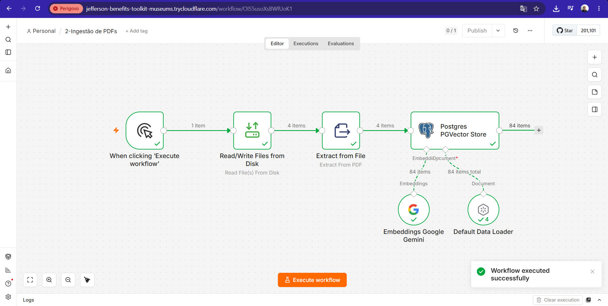
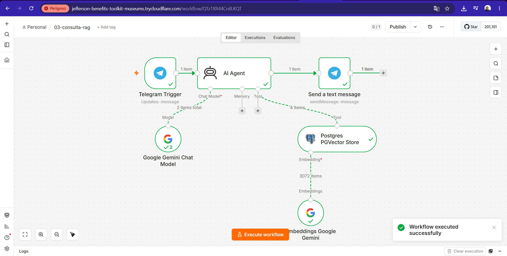
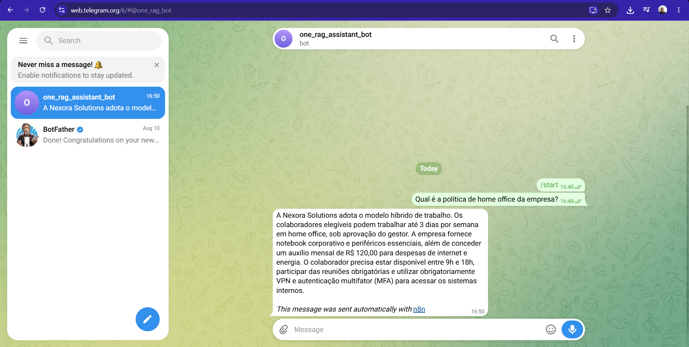

# Challenge ONE RAG

Projeto desenvolvido como parte da formação **Oracle Next Education (ONE)**.

## 🎯 Objetivo

Construir um agente de Inteligência Artificial utilizando arquitetura **RAG (Retrieval-Augmented Generation)**, capaz de responder perguntas com base em documentos PDF fornecidos como base de conhecimento.

A solução utiliza um bot no **Telegram** como interface de interação, permitindo que o usuário envie perguntas em linguagem natural e receba respostas contextualizadas a partir dos documentos processados pelo sistema.

## 🧠 Arquitetura RAG

O projeto utiliza a arquitetura **Retrieval-Augmented Generation (RAG)** para combinar recuperação de informações com modelos generativos de IA.

O processo ocorre em duas etapas principais:

### 1. Ingestão dos documentos

Os arquivos PDF são:

1. carregados pelo n8n;
2. extraídos e convertidos em texto;
3. fragmentados em **chunks**;
4. transformados em **embeddings** utilizando Google Gemini;
5. armazenados no **PostgreSQL com pgvector**.

### 2. Consulta RAG

Quando uma pergunta é enviada pelo Telegram:

1. o Telegram envia a mensagem para o webhook do n8n;
2. o AI Agent recebe a pergunta;
3. a pergunta é transformada em embedding;
4. o PGVector realiza uma busca semântica na base vetorial;
5. os trechos mais relevantes dos documentos são recuperados;
6. o Google Gemini utiliza esse contexto para gerar a resposta;
7. o n8n envia a resposta de volta ao usuário pelo Telegram.

## 🏗️ Arquitetura da solução

```text
                    Usuário
                       │
                       ▼
                 Telegram Bot
                       │
                       │ HTTPS / Webhook
                       ▼
             Cloudflare Quick Tunnel
                       │
                       ▼
                Amazon EC2 (AWS)
                       │
                Docker Compose
                 ┌─────┴─────┐
                 │           │
                 ▼           ▼
                n8n      PostgreSQL
                 │        + pgvector
                 │           ▲
                 │           │
                 ├── Embeddings ──► Google Gemini
                 │
                 └── AI Agent ────► Google Gemini
                       │
                       ▼
                Resposta Telegram
```

## 🛠️ Tecnologias utilizadas

- **n8n (Self-Hosted)** — automação e orquestração dos workflows
- **Docker** — containerização da aplicação
- **Docker Compose** — gerenciamento dos containers
- **Amazon Web Services (AWS EC2)** — infraestrutura de nuvem
- **PostgreSQL** — banco de dados
- **pgvector** — armazenamento e busca vetorial
- **Google Gemini** — LLM e geração de embeddings
- **Telegram Bot API** — interface de comunicação com o usuário
- **Cloudflare Tunnel** — exposição HTTPS do n8n
- **Git & GitHub** — versionamento do projeto

## 🔄 Workflows

A solução foi organizada em workflows independentes.

### 01 — Bot Telegram

Workflow desenvolvido durante a primeira etapa do projeto para validar a integração entre **Telegram e n8n**.

Foi utilizado como parte da evolução e dos testes da solução.

### 02 — Ingestão de PDFs

Responsável pela construção da base de conhecimento do RAG.

```text
PDFs
  ↓
Extração de texto
  ↓
Divisão em chunks
  ↓
Gemini Embeddings
  ↓
PostgreSQL + pgvector
```

Os documentos de teste são processados e armazenados como vetores para permitir posteriormente a busca semântica.

### 03 — Consulta RAG

Workflow principal da solução.

```text
Telegram Trigger
       ↓
    AI Agent
    ↙     ↘
Gemini   PGVector
            ↓
        Embeddings
       ↓
Telegram Response
```

O agente consulta a base vetorial para recuperar informações relevantes antes de gerar a resposta ao usuário.

## 📄 Documentos de teste

Para validar a solução foram utilizados documentos fictícios contendo informações corporativas, como:

- política de home office;
- política de férias;
- benefícios;
- política de segurança da informação.

Esses documentos são utilizados exclusivamente para demonstração e testes da arquitetura RAG.

## ☁️ Deploy na AWS

A aplicação foi implantada em uma instância **Amazon EC2 (AWS)**.

Os serviços são executados utilizando **Docker Compose**:

```text
Amazon EC2
    │
    └── Docker Compose
          ├── n8n
          └── PostgreSQL + pgvector
```

Os dados do n8n e do PostgreSQL utilizam **volumes Docker persistentes**, permitindo preservar configurações e dados mesmo após a recriação dos containers.

## 🌐 Acesso público e Cloudflare Tunnel

Para permitir que o **Telegram** acesse o webhook do n8n através de HTTPS, foi utilizado o **Cloudflare Tunnel**.

Nesta versão do projeto é utilizado um **Cloudflare Quick Tunnel**, que gera uma URL HTTPS temporária no domínio:

```text
trycloudflare.com
```

O túnel encaminha as requisições HTTPS recebidas da internet para o n8n executado na porta `5678` da instância EC2.

```text
Telegram
    ↓
Cloudflare Quick Tunnel (HTTPS)
    ↓
Amazon EC2
    ↓
n8n :5678
```

### ⚠️ URL temporária

O endereço fornecido pelo **Cloudflare Quick Tunnel é temporário** e pode mudar sempre que o túnel for reiniciado.

Por esse motivo, a URL gerada pelo túnel **não é armazenada neste repositório**.

Sempre que um novo túnel é criado, a variável `WEBHOOK_URL` deve ser atualizada no arquivo `.env` da instância EC2.

Exemplo:

```env
WEBHOOK_URL=https://<url-temporaria>.trycloudflare.com
```

Após a alteração, o container do n8n deve ser recriado para carregar a nova configuração:

```bash
docker compose up -d --force-recreate n8n
```

Para um ambiente de produção, uma evolução recomendada é utilizar um **Cloudflare Tunnel permanente associado a um domínio próprio**, eliminando a necessidade de atualização manual da URL do webhook.

## 🔐 Segurança

Dados sensíveis **não são versionados no repositório**.

O arquivo `.env` é ignorado pelo Git e concentra configurações específicas do ambiente.

Credenciais como:

- Token do Telegram Bot;
- API Key do Google Gemini;
- usuário e senha do PostgreSQL;

são configuradas diretamente no ambiente de execução e/ou no gerenciador de credenciais do n8n.

Um arquivo `.env.example` pode ser utilizado para documentar as variáveis necessárias sem expor valores reais.

## 📂 Estrutura do projeto

```text
challenge-one-rag/
│
├── documentos/
│   ├── manual-beneficios.pdf
│   ├── politica-ferias.pdf
│   ├── politica-home-office.pdf
│   └── politica-seguranca-informacao.pdf
│
├── workflows/
│   ├── 01-bot-telegram-rag.json
│   ├── 02-ingestao-pdfs-rag.json
│   └── 03-consulta-rag.json
│
├── docker-compose.yml
├── .env.example
├── .gitignore
└── README.md
```

## ✅ Roadmap

- [x] Configuração do ambiente Docker
- [x] Integração com Telegram
- [x] Ingestão de documentos PDF
- [x] Geração de embeddings
- [x] Configuração do PostgreSQL + pgvector
- [x] Implementação da arquitetura RAG
- [x] Integração com Google Gemini
- [x] Deploy na Amazon EC2
- [x] Exposição HTTPS via Cloudflare Tunnel
- [x] Teste ponta a ponta pelo Telegram
- [x] Documentação final

## 📸 Evidências de funcionamento

### 1. Ingestão dos documentos

Execução do workflow responsável pela leitura dos arquivos PDF, extração do conteúdo, geração dos embeddings com Google Gemini e armazenamento dos vetores no PostgreSQL com pgvector.

Nesta execução, os 4 documentos de teste foram processados com sucesso, resultando na geração e armazenamento dos chunks utilizados pela base de conhecimento do RAG.



### 2. Consulta RAG

Execução ponta a ponta do workflow principal da solução.

A pergunta é recebida pelo Telegram, processada pelo AI Agent, que consulta semanticamente a base vetorial no PostgreSQL/pgvector e utiliza o Google Gemini para gerar a resposta com base no contexto recuperado.



### 3. Resultado no Telegram

Exemplo de interação com o agente:

**Pergunta:** Qual é a política de home office da empresa?

O agente recuperou as informações presentes nos documentos da base de conhecimento e enviou automaticamente a resposta ao usuário pelo Telegram.



## 🚀 Resultado

O projeto foi validado ponta a ponta em ambiente de nuvem.

O usuário envia uma pergunta pelo **Telegram**, o agente executado no **n8n na AWS** consulta semanticamente os documentos armazenados no **PGVector**, utiliza o **Google Gemini** para gerar uma resposta contextualizada e retorna o resultado diretamente pelo Telegram.

```text
Pergunta no Telegram
        ↓
Recuperação semântica no RAG
        ↓
Contexto recuperado dos PDFs
        ↓
Resposta gerada pelo Gemini
        ↓
Resposta enviada ao Telegram
```
## 📸 Evidências de funcionamento

### 1. Ingestão dos documentos

Execução do workflow responsável pela leitura dos PDFs, geração dos embeddings e armazenamento dos vetores no PostgreSQL com pgvector.


O projeto demonstra na prática conceitos de **IA Generativa, RAG, embeddings, banco vetorial, automação, APIs, containers e Cloud Computing**.
